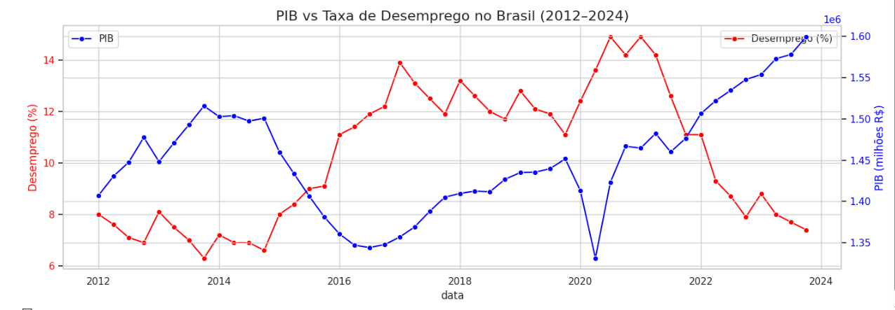

# 📊 Análise de Correlação entre PIB e Taxa de Desemprego no Brasil (2012–2024)

Este projeto de portfólio tem como objetivo analisar a relação entre o Produto Interno Bruto (PIB) e a Taxa de Desemprego no Brasil, no período de 2012 a 2024, utilizando ferramentas de análise de dados em Python.

---

## 🎯 Objetivo

Investigar a existência de correlação entre a taxa de desemprego e o desempenho econômico do país (PIB), com foco na identificação de padrões históricos e efeitos de crises econômicas ao longo do tempo.

---

## 🧩 Dados Utilizados

Os dados foram extraídos dos seguintes conjuntos:

- **Taxa de Desemprego Trimestral (2012–2024)**  
  Fonte: IBGE / Tabela 6368 - PNAD Contínua

- **Produto Interno Bruto (PIB) Trimestral (2012–2024)**  
  Fonte: IBGE - Contas Nacionais Trimestrais

---

## 🛠️ Tecnologias Utilizadas

- Python
- Pandas
- Matplotlib
- Seaborn
- Google Colab
- Jupyter Notebook

---

## 📈 Análises Realizadas

- Tratamento e transformação dos dados em formato trimestral unificado
- Visualização de séries temporais para PIB e Desemprego
- Gráfico comparativo com duplo eixo (PIB x Desemprego)
- Cálculo de correlação entre as variáveis

---

## 🔍 Principais Insights

- Há uma **correlação negativa** entre PIB e Desemprego, ou seja, à medida que o PIB cresce, a taxa de desemprego tende a cair.
- Em períodos de crise econômica (2015–2016 e 2020), observou-se queda no PIB e aumento significativo no desemprego.
- Após a pandemia de COVID-19, a recuperação econômica a partir de 2021 impactou positivamente o mercado de trabalho.

---

## 📷 Exemplos de Visualizações

  

